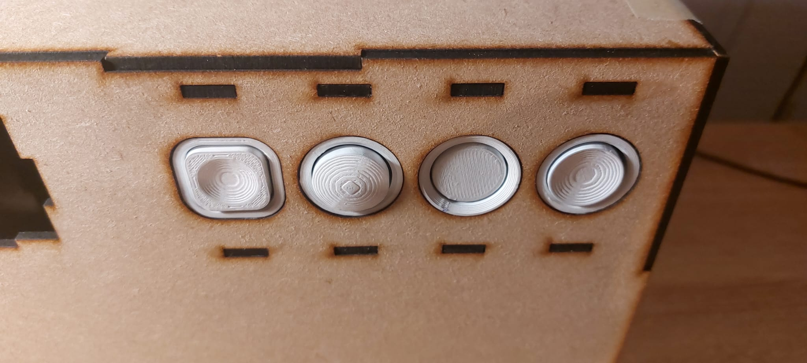
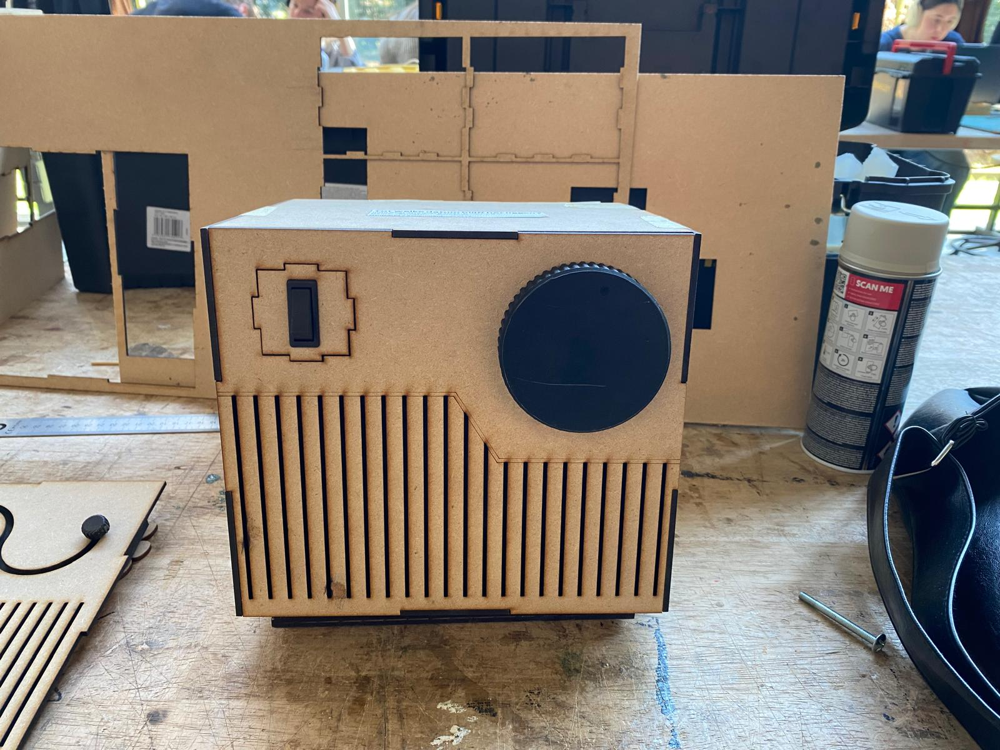
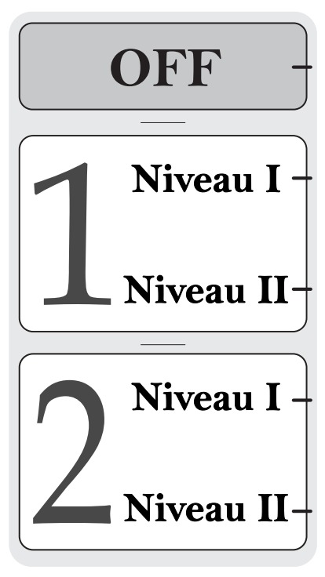
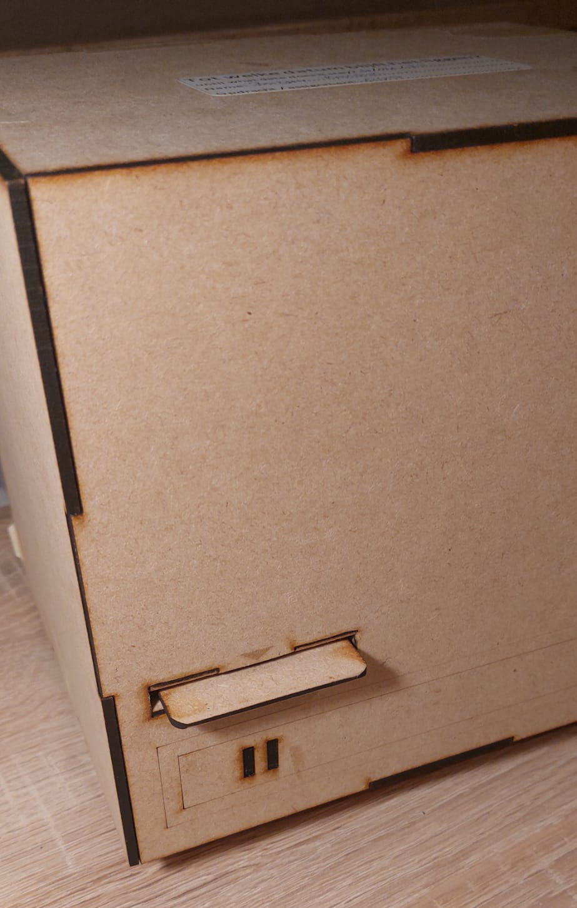
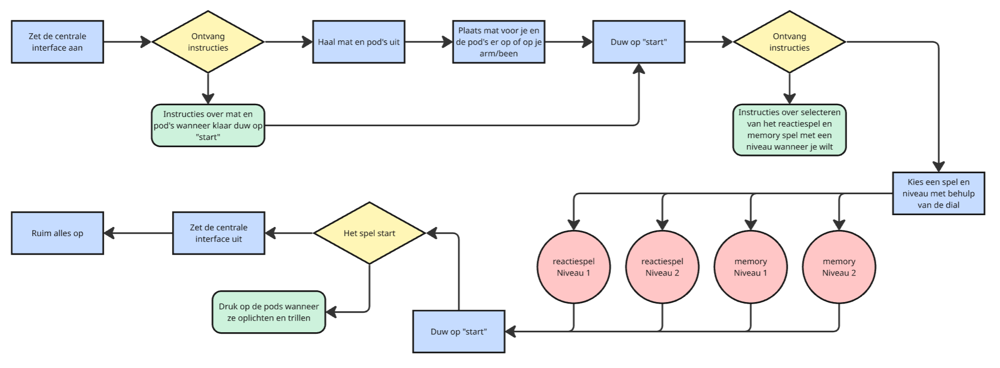

# Selico
Met ons product kan de gebruiker (65+ in een woonzorgcentrum) zelfstandig de motoriek en het cognitief vermogen verbeteren aan de hand van de voorgeschreven oefeningen van de kinesist.

Projectteam: Bojan Ronsijn; Reijn Lapere
Datum: 05/12/2024

## Samenvatting
Het groeiende tekort aan personeel in zorg- en revalidatiecentra, in combinatie met de stijgende vraag naar effectieve revalidatie- en stimulatiemethoden, vraagt om innovatieve oplossingen. Hedendaagse methoden vereisen vaak begeleiding, waardoor de werkdruk voor zorgverleners toeneemt en de autonomie van gebruikers wordt beperkt [^1], [^2], [^3].

Om dit probleem aan te pakken, hebben we verschillende onderzoeksactiviteiten uitgevoerd. We hebben expertinterviews gehouden met zorgverleners, kinesisten en andere professionals met ervaring in het vak, en een benchmarkanalyse uitgevoerd. We observeerden een bewegingssessie in een woonzorgcentrum en voerden twee testfases uit, waarbij we gebruikerstests en scenario’s doorliepen om de praktische toepassing te evalueren. We verdiepten ons ook in bewezen Ronnie Gardiner Methode, die effectief cognitieve en motorische vaardigheden stimuleert door middel van ritme en multisensorische prikkels.

"Selico" is een interactief systeem dat de gebruiker multisensorisch uitdaagt door middel van licht, trillingen en druk. Het systeem stelt kinesisten in staat om gepersonaliseerde oefeningen te ontwerpen die de gebruiker zelfstandig kan uitvoeren, zonder constante begeleiding. Door deze autonomie te vergroten, helpt het systeem zorgverleners te ontlasten, wat de werkdruk vermindert. Het biedt een innovatieve oplossing voor de huidige tekortkomingen in de zorg, waar de behoefte aan effectieve, zelfstandige therapie groeit.

<p align="center">
  
  

> [!Note]
> - Volledige protocollen en rapporten zijn beschikbaar in de sectie [bijlagen](https://github.com/reijnlapere/PGG-Ageing-Young/edit/main/README.md#bijlagen).
> - Ruwe data zoals foto's, notities en video-opnames zijn terug te vinden in de protocollen en reports.
> - Alle geraadpleegde bronnen zijn te vinden in de sectie [bronnen](https://github.com/reijnlapere/PGG-Ageing-Young/edit/main/README.md#bronnen).


## Introductie
De vergrijzing en het groeiende tekort aan zorgpersoneel in woonzorgcentra en revalidatiecentra creëren een dringende behoefte aan innovatieve oplossingen die zorgvragers zelfstandiger maken en zorgverleners ontlasten. Vooral in de revalidatie en cognitieve stimulatie is de vraag naar efficiënte, toegankelijke hulpmiddelen groot.

Ons project richt zich op het ontwikkelen van een interactief, multisensorisch systeem dat gebruikers zelfstandig kan helpen bij het verbeteren van hun motorische, cognitieve en reactieve vaardigheden. De kern van ons systeem bestaat uit een combinatie van slim gepositioneerde pods, een centrale interface en een ondersteunende app. Deze methode combineert ritme, beweging en sensorische prikkels voor optimale activering van lichaam en geest.

De doelstelling van het project is het bieden van een gebruiksvriendelijk en flexibel systeem dat zelfstandig gebruik stimuleert. Een belangrijke voorwaarde is dat de gebruiker zonder constante begeleiding het systeem kan bedienen. Daarnaast moet het systeem eenvoudig aanpasbaar zijn aan individuele behoeften en niveaus, wat mogelijk wordt gemaakt door een door een kinesist ontworpen configuratie via een app.

Met deze oplossing hopen we niet alleen de werkdruk in de zorg te verlichten, maar ook de levenskwaliteit en zelfstandigheid van zorgvragers te vergroten.


## Methodologie
Het ontwikkelingsproces van Selico volgde een iteratieve en gebruiksgerichte aanpak, waarbij de behoeften van gebruikers centraal stonden. 

In de eerste fase, de exploratiefase, onderzochten we de problematiek rondom motorische en cognitieve stimulatie bij ouderen in woonzorgcentra. Het tekort aan zorgpersoneel en de beperkte autonomie van ouderen vormden de kern van het probleem. Om dit goed te begrijpen, moesten we dieper gaan. We voerde expertinterviews uit met kinesisten, psychologen en zorgverleners. Daarnaast observeerden we een bewegingssessie in een woonzorgcentrum. Hier analyseerden we hoe visuele, auditieve en tactiele prikkels de prestaties en betrokkenheid beïnvloedden. Een benchmarkanalyse van bestaande producten, zoals de Tovertafel en Bob It, gaf inzicht in wat al beschikbaar was en waar de hiaten lagen. Deze onderzoeken resulteerden in een scherp geformuleerde probleemstelling en eerste ontwerpvereisten.

In de definitiefase verdiepten we ons verder in het probleem en starten we met het opstellen van een storyboard om de volledige user journey vast te leggen. Deze aanpak bracht verschillende aspecten en componenten van het product aan het licht die nader gespecificeerd moesten worden. Het testen van deze componenten werd opgesplitst in twee afzonderlijke testfasen, waarbij voor elke fase prototypes werden ontwikkeld die gericht waren op specifieke eigenschappen of functionaliteiten van het product.

Met deze prototypes zochten we meteen de eerste gebruikers op om feedback te verzamelen.Per testfase zochten we minimaal 5 verschillende gebruikers en een kinesist. Op basis van deze inzichten werden de nodige aanpassingen doorgevoerd, met als doel een gebruiksvriendelijk en frictieloos ontwerp te creëren dat een optimale user experience biedt. Na elke testfase werd een analyse uitgevoerd, waarbij we essentiële design requirements vaststelden. Deze requirements dienden als leidraad voor het ontwikkelen van ons finaal concept.

<p align="center">
  

## Discovery  (N=20)

### Doelstellingen  
Dit project onderzocht de uitdagingen van 65-plussers met motorische beperkingen. De belangrijkste onderzoeksvragen waren:  
- Hoe kunnen zij effectief worden uitgedaagd zonder overbelasting?  
- Wat is de rol van personalisatie bij het aanpassen van activiteiten?  
- Hoe beïnvloedt het betrekken van zintuigen hun prestaties?  
- Hoe kan technologie (zoals smart devices) effectief worden ingezet zonder complexiteit te introduceren?  

Het doel was hierbij een helder geformuleerde "how might we" bekomen. 

### Materiaal & Methodes  

#### Expert Interviews (N=3)
Interviews met drie professionals – Bruno (onderzoeker van een gelijkaardig project), Heleen (begeleider in een woonzorgcentrum), en Koen (psycholoog voor ouderen met niet-aangeboren hersenletsel) – gaven inzichten in de uitdagingen van de doelgroep en effectieve benaderingen voor fysieke activiteiten.  

#### Observatiesessie (N=17)
Tijdens een observatiesessie met 65-plussers werden fysieke en cognitieve reacties op verschillende oefeningen geanalyseerd. Elementen zoals rekkers en stokken werden gebruikt, en de begeleiding door instructeurs werd geanalyseerd. Zij wisselden oefeningen af, boden duidelijke en herhaalde instructies (verbaal en visueel) en besteedden persoonlijke aandacht aan deelnemers met specifieke behoeften. Daarnaast werd geobserveerd hoe visuele, auditieve en tactiele prikkels betrokkenheid en prestaties beïnvloedden.  

#### Benchmarking  
Bestaande producten zoals de "Bob It"-spellen, de Tovertafel, en interactieve tafels werden geëvalueerd. Deze benchmarks boden inspiratie, maar vaak ontbrak een combinatie van fysieke en visuele interactie.  


### Resultaten  

- **Problematiek bij motorische beperkingen:** De belangrijkste problemen die 65-plussers met motorische beperkingen ondervinden, zijn gerelateerd aan mobiliteit, krachtverlies en coördinatieproblemen. Dit heeft invloed op hun vermogen om deel te nemen aan fysieke activiteiten, vooral als er sprake is van specifieke aandoeningen zoals niet-aangeboren hersenletsel (NAH). Koen benadrukte dat de beperkingen sterk variëren afhankelijk van het type hersenletsel (ouderdom vs. trauma), wat het noodzakelijk maakt om een gepersonaliseerde benadering toe te passen.

- **Personalisatie:** Een belangrijke conclusie uit de interviews was dat personalisatie essentieel is om de effectiviteit van bewegingsprogramma’s te waarborgen. Zowel Bruno als Koen wezen erop dat oefeningen moeten worden aangepast op basis van het individuele niveau van de deelnemer. Dit kan variëren van lichte oefeningen voor mensen met beperkte mobiliteit tot intensievere oefeningen voor mensen die in staat zijn om te staan en zich te verplaatsen. Het ontwerp van het product moet de mogelijkheid bieden om deze niveaus gemakkelijk in te stellen en aan te passen.

- **Zintuiglijke stimulatie:** De impact van het betrekken van meerdere zintuigen werd herhaaldelijk benadrukt. Zowel Bruno als Koen gaven aan dat het brein van ouderen, met name diegenen die te maken hebben met motorische of cognitieve beperkingen, sterker reageert op oefeningen die gebruik maken van verschillende zintuiglijke prikkels, zoals visuele, auditieve en tactiele stimuli. Dit kan bijvoorbeeld worden bereikt door kleuren, geluiden en eenvoudige iconen te integreren in de interface van het product. Bruno raadde specifiek het gebruik van kleuren aan om verschillende oefeningen of posities aan te geven, terwijl Koen de voordelen van het gebruik van iconen in plaats van kleine tekst benadrukte om de leesbaarheid te vergroten.

- **Motivatie:** Een ander belangrijk onderwerp dat naar voren kwam, was de motivatie van de doelgroep. Heleen en Koen gaven aan dat motivatie vaak een uitdaging is, met sommige ouderen die enthousiast zijn over de activiteiten en anderen die weinig interesse tonen. Beide experts benadrukten dat het essentieel is om het product aantrekkelijk te maken, zodat het niet aanvoelt als een verplichting. De suggestie om een puntensysteem of een spelcomponent toe te voegen (zoals een "Bob It"-achtig spel) werd door beiden goed ontvangen. Dit zou deelnemers kunnen motiveren door hen een doel te geven om naar toe te werken en de mogelijkheid te bieden om hun voortgang te meten.

- **Gebruik van smart devices:** Het gebruik van smart devices werd als een potentieel nuttige oplossing gepresenteerd, maar er waren belangrijke beperkingen. Heleen gaf aan dat het voor ouderen moeilijk kan zijn om met technologie om te gaan, vooral wanneer er meerdere kabels of complexe interfaces betrokken zijn. Ze benadrukte dat de interface eenvoudig en gebruiksvriendelijk moet zijn, zodat het product zelfstandig kan worden gebruikt, eventueel met minimale begeleiding. Dit werd ondersteund door Bruno, die aangaf dat het gebruik van een simpele interface en grote knoppen de toegankelijkheid zou verbeteren.

- **De rol van de begeleider:** Begeleiders zijn essentieel in woonzorgcentra om diverse aspecten van zorg te waarborgen. Het is daarom belangrijk dat het product zo ontworpen wordt dat het hen ontlast, zodat zij meer tijd kunnen besteden aan de cruciale taken en senioren niet achteruitgaan door gebrek aan beweging.

- **Benchmark Analyse:** Tijdens ons zoektocht naar verschillende benchmarks viel het op dat sommige producten, zoals de SilverFit, MemoreBox, en Jintronix, een vergelijkbare werking hebben. Deze producten zijn grotendeels virtueel gericht en missen een tastbaar aspect. Koen noemde bijvoorbeeld de Tovertafel, die de zintuigen aanspreekt door spellen te integreren die zowel cognitieve als motorische vaardigheden stimuleren. Ondanks het interactieve karakter van de Tovertafel, blijft het aanbod van tactiele elementen, zoals het aanraken van objecten, beperkt. Dit benadrukt het belang van een product dat zowel visueel als fysiek uitdaagt. Zo werd een ander product genoemd: een interactieve tafel voor groepsspelletjes, zoals schaak, dat kan variëren van eenvoudige tot complexe spellen, en goed aansluit bij de sociale interactie. Koen wees erop dat dergelijke producten ouderen kunnen helpen om cognitieve vaardigheden te behouden, maar wel met een toegankelijke, intuïtieve interface.

### Conclusies:
Het product moet **persoonlijk aanpasbaar** zijn, zodat het verschillende niveaus van fysieke en cognitieve vaardigheden ondersteunt. **Zintuiglijke stimulatie** speelt een cruciale rol, met nadruk op kleurgebruik, visuele iconen en auditieve feedback. **Motivatie** wordt gestimuleerd door gamificatie, bijvoorbeeld door een puntensysteem of competitie tussen gebruikers. De interface moet **gebruiksvriendelijk** zijn, met duidelijke pictogrammen en grote tekst. Het product biedt verschillende niveaus van **flexibiliteit**, waardoor het zowel individueel als in kleine groepen kan worden gebruikt. **Sociale interactie** en samenwerking worden bevorderd door groepsactiviteiten en spellen met spelelementen, zoals de interactieve tafel.

Met deze inzichten is de basis gelegd voor een effectief en toegankelijk product dat ouderen met motorische beperkingen helpt fysiek actief te blijven.  


<p align="center">
  
  
    
</p>


>  [!IMPORTANT]
> Design Requirements:
> - D1.1 De spellen maken onderscheid tussen het onthouden en reproduceren van acties.
> - D3.2 De interface bevat een scoresysteem dat ontworpen is om gebruikers te motiveren en competitie te stimuleren.


## Definition (N=12)
De _definition_ fase heeft als doel om duidelijke richtlijnen en specificaties op te stellen voor het ontwerp en de functionaliteit van Selico. Dit wordt gedaan door inzichten uit de gebruikstesten te analyseren en deze om te zetten in concrete ontwerp- en ontwikkelbeslissingen.

### Doelstellingen
Een conctrete en gebruiksvriendelijke methode bekomen om informatie tussen kinesiste en gebruiker uit te wisselen.
Een finaal conceptueel ontwerp bekomen.

### Materiaal & methoden
- _quick-and-dirty_ prototype variaties van mat en interface
- Storyboard
- 4 ledlichtjes manueel te bedienen
- app prototype variaties
- gebruikersinterviews
- gebruikerstesten

### Resultaten
Aan de hand van gebruikerstesten wordt het concept kritisch geëvalueerd met behulp van potentiële gebruikers. Tijdens het onderzoek zijn twee _waves_ getest. De eerste _wave_ vond plaats op de dementieafdeling van WZC T’Huis, terwijl de tweede werd uitgevoerd op de afdeling waar de bewoners motorisch beperkt zijn. Bij beide testfases werd gestart met een kennismaking met de kinesist, waarna het concept werd toegelicht. Vervolgens werd de mening van de kinesist gevraagd en werden mogelijke pijnpunten in kaart gebracht. Daarna werd het _storyboard_ doorlopen: de kinesist gaf een uitleg aan de bewoner, terwijl geobserveerd werd hoe dit proces verliep. In de tweede _wave_ werd bovendien het spel gesimuleerd, waarna feedback werd verzameld.

#### Interface
Uit de eerste conceptgeneratie werd een cilindrische interface ontwikkeld, waarin de pods waren geplaatst en waarbij de startknop en spelknoppen zich aan de bovenzijde bevonden. Ter bevordering van variatie werd tevens een kubische interface ontworpen. Hoewel uit gebruikersonderzoek bleek dat dit voor de gebruikers geen verschil maakte, werd door de kinesist aangegeven dat de kubische interface geschikter was voor opslag. Op basis hiervan werd verder geïtereerd, en in _Wave 2_ (W2) werd aan de bewoners, met behulp van een _mockup,_ gevraagd of de voorkeur uitging naar een enkele draaiknop dan wel afzonderlijke drukknoppen.
Een positief aspect was de toevoeging van een feedbackstem, waarbij een speaker werd gebruikt om ingesproken fragmenten af te spelen, ter ondersteuning van de bewoner bij het gebruik van het product. Bij het _memory_-spel werd opgemerkt dat het voor de gebruiker niet altijd duidelijk was wanneer er gekeken en onthouden moest worden en wanneer de daadwerkelijke uitvoering verwacht werd.

<p align="center">
  
    
</p>

#### Pod's
Uit de eerste testfase werd al snel duidelijk dat een onderscheidende markering van de pods een essentiële factor is. Aanvankelijk werd ervoor gekozen om elke pod aan de onderzijde van een specifieke kleur te voorzien. Deze oplossing bleek echter niet effectief, aangezien gebruikers bij het omdraaien van de pods de onderzijde vaak als bovenzijde interpreteerden. Bovendien was het voor hen niet onmiddellijk duidelijk waar zij moesten kijken om de kleur te herkennen. Deze bevindingen werden meegenomen naar de tweede testfase, waarin vier varianten van de accentkleur op de pods werden ontwikkeld. De voorkeur werd gegeven aan een accentkleur op de rand van de pod, zij het in een dikkere uitvoering dan de huidige (zoals toegepast bij de groene pod). Daarnaast werd door de kinesist in de eerste testweek gesuggereerd om de pods ruimer te verspreiden, een voorstel dat door de kinesist in de tweede testweek werd aangevuld met het idee om de pods ook aan de muren te bevestigen. Een bijkomende observatie was dat wanneer de pods op het lichaam werden bevestigd, deze niet altijd binnen het gezichtsveld vielen, waardoor gebruikers soms moesten zoeken naar de pod die licht gaf.

<p align="center">
  
  
  
  
</p>

#### Matten
Oorspronkelijk werden twee matten voorzien: één voor de handen en één voor de voeten. De mat voor de handen kon in alle gevallen worden gebruikt, zelfs wanneer slechts één hand werd ingezet. De mat voor de voeten daarentegen werd vaker achterwege gelaten, voornamelijk vanwege het gebruik van rolstoelen. Aangezien het product zelfstandig gebruikt moet kunnen worden, dient ook de mat voor de voeten op de grond te worden geplaatst (onder de tafel). Dit kan echter een aanzienlijke barrière tot gebruik vormen. Daarnaast werd een probleem vastgesteld met betrekking tot de bewegingsvrijheid van de voeten in een 360°-radius, aangezien de (rol)stoel hierbij een obstakel kan vormen. Uit de eerste testfase werd geconcludeerd dat de mat voor de handen in omvang vergroot diende te worden. Dit werd gerealiseerd door de lengte van de mat zo groot mogelijk te maken, zodat de uiterste pods nog net bereikbaar bleven voor de gemiddelde 65-plusser. Hierbij werd gebruikgemaakt van de DINBelg-normen. Verder werd vastgesteld dat de mat voor de voeten gemakkelijk verschoof tijdens gebruik.

<p align="center">
  
  
</p>
<p align="center">
  
  
</p>

#### Communicatie
De communicatie tussen de kinesist en de gebruiker wordt beschouwd als een essentieel onderdeel van het product. Het is de bedoeling dat de gebruiker gepersonaliseerde pod-posities ontvangt van de kinesist, zodat specifieke spiermassa’s geoefend kunnen worden. Aanvankelijk werden verschillende oplossingen overwogen. Eén optie betrof een fysiek boekje met letters, cijfers en symbolen, die met velcro of als stickers konden worden bevestigd. Daarnaast werd een applicatie ontwikkeld waarin de kinesist de benodigde informatie kon invoeren, waarna deze kon worden afgedrukt. De weergegeven tekens bleven echter identiek aan die in het fysieke boekje, waardoor de bewoners deze op dezelfde manier moesten interpreteren. Deze tekens verwezen naar coördinaten op een van de twee matten. Uit de eerste testfase bleek dat de gebruikers moeite hadden met deze methode. Bovendien was een korte introductie noodzakelijk voor elke nieuwe gebruiker om de instructies correct te kunnen lezen. Indien het product zelfstandig gebruikt moet kunnen worden, dient dit aspect te worden verbeterd. Om die reden werd de methode vereenvoudigd door per mogelijke pod-positie een uniek figuur te gebruiken. Hoewel deze aanpassing tot een verbeterde ervaring leidde, werd vastgesteld dat de oplossing nog steeds niet optimaal was.

<p align="center">
  
  
</p>
<p align="center">
  
  
  
</p>

### Conclusies & implicaties
De meeste bewoners gaven de voorkeur aan afzonderlijke drukknoppen. Daarnaast werd er een voorkeur waargenomen voor de positionering van de knoppen aan de voorkant van de interface in plaats van aan de bovenkant. Dit zorgt ervoor dat, wanneer de interface voor de gebruiker wordt geplaatst en de mat voor de handen zich ertussen bevindt, er minder ver gereikt hoeft te worden. Daarnaast dient een punten- en/of levenssysteem te worden toegevoegd. Een dergelijk systeem voegt een spelelement toe dat gebruikers motiveert en uitdaagt. Bovendien kan hierdoor de moeilijkheidsgraad van de spellen progressief worden verhoogd. Bij het memoryspel dient een duidelijk onderscheid te worden gemaakt tussen het “onthouden” en het “reproduceren”. Dit kan worden gerealiseerd door middel van geluid of kleur.
<br>
<br>
> “Hoeveel punten heb ik”
<br>
Een belangrijke functie die aan de pods kan worden toegevoegd, is een trilfunctie. Op deze manier kunnen de pods die aan het lichaam bevestigd zijn, sneller worden waargenomen wanneer zij licht geven. Daarnaast werd aangegeven dat de pods aan de muur bevestigd moeten kunnen worden met behulp van zuignappen.
De mat voor de voeten kan optioneel worden aangeboden. Daarnaast dient er een antisliplaag op de matten te worden aangebracht.
Uit de puntenmatrix blijkt dat kinesisten de voorkeur geven aan het gebruik van een app, waarna de gegevens in een map voor de bewoners worden opgeslagen. Om het systeem voor de bewoners verder te vereenvoudigen, zal het huidige systeem van tekens worden vervangen door mapping. Op deze manier wordt op schaal weergegeven waar de pods zich moeten bevinden, waardoor deze eenvoudiger in de praktijk kunnen worden geplaatst.

<p align="center">
  
</p>

>  [!IMPORTANT]
> Design Requirements:
> - D1.2 De positiemat is optioneel beschikbaar en ontworpen voor middelmatige bewegingen te ondersteunen. 
> - D1.3 De moeilijkheidsgraad van de spellen neemt progressief toe naarmate de gebruiker langer bezig is.
> - D2.1 De pods moeten opgemerkt worden door de gebruiker zowel op de tafel als op de ledematen.
> - D2.2 De pods zijn eenvoudig te positioneren.
> - D2.3 De pods zijn eenvoudig in te drukken en reageren gevoelig op druk voor een intuïtieve gebruikerservaring.
> - D3.1 De interface kan worden bediend binnen het bereik van de gebruiker (percentage).
> - D3.3 De interface biedt auditieve feedback wanneer nodig.
> - D3.4 De interface biedt opbergruimte voor alle bijbehorende componenten van het product.
> - D3.5 De interface heeft een robuuste en praktische vorm, zodat deze eenvoudig kan worden opgeborgen en gestapeld.
> - D4.1 De mobiele applicatie is overzichtelijk en efficiënt te gebruiken (binnen een tijd van..).
> - D4.2 De mobiele applicatie is compatibel met smartphones en computers.
> - D4.3 De mobiele applicatie beschikt over een printfunctie.


### Bill of materials
- Force Sense Resistors (FSRs)
- RGB Led's
- Processor (Arduino)
- Versterker (MP3-Module)
- Voeding
- ERM-motor
- Antis-slip (rubber, PVC)
- Scharnieren
- Kabels (geleiders)
  

### Kritische reflectie
Tijdens het eerste semester is gewerkt aan het project Selico, waarbij de focus lag op de discovery- en definition-fase. Dit proces heeft niet alleen geleid tot waardevolle resultaten, maar ook tot belangrijke inzichten in de werkwijze en aanpak.

Een van de belangrijkste succesfactoren werd gevormd door een sterke planning, die in Trello werd opgesteld, en door effectieve communicatie. Vanaf de start zijn duidelijke afspraken gemaakt met betrekking tot deadlines, taakverdeling en werkwijzen. Door regelmatige check-ins werd ervoor gezorgd dat alle betrokkenen op de hoogte bleven van de voortgang en dat eventuele knelpunten tijdig konden worden aangepakt. Hierdoor kon het project zonder noemenswaardige vertragingen worden afgerond, wat als een groot voordeel wordt beschouwd.

Tijdens de discovery-fase werd vastgesteld hoe waardevol audio-opnames en ‘rough data’ zijn en welke informatie verloren gaat indien deze niet in rekening worden gebracht. Deze bevindingen zijn meegenomen naar de definition-fase om een optimale analyse mogelijk te maken. Wat betreft de uitvoering van het onderzoek, werd vastgesteld dat de onderzoeksvragen in sommige gevallen te breed waren geformuleerd. Hoewel hierdoor een uitgebreid perspectief werd verkregen, bleek het soms een uitdaging om diepgaande analyses uit te voeren. Daarnaast werd pas in een later stadium duidelijk dat bepaalde aspecten verder hadden kunnen worden uitgediept. Desondanks is waardevolle informatie verzameld, die als een stevige basis diende voor de verdere ontwikkeling van ideeën. Deze ervaring heeft aangetoond dat in de toekomst specifieker geformuleerde onderzoeksvragen kunnen bijdragen aan gefocuste en gedetailleerde resultaten.

Ook de samenwerking binnen het team werd als een sterk punt ervaren. De verschillende kwaliteiten en inzichten van de teamleden droegen bij aan een divers en creatief proces. Dit werd met name zichtbaar tijdens brainstormsessies en bij de evaluatie van onderzoeksresultaten, waarbij teamleden elkaar aanvulden en kritisch hielden. Deze samenwerking resulteerde niet alleen in kwalitatieve resultaten, maar ook in een constructieve en aangename werksfeer.

Hoewel er ruimte is voor verbetering, wordt met voldoening teruggekeken op het eerste semester. Trots heerst over de behaalde resultaten en de opgedane inzichten met betrekking tot onderzoek en teamwork. De lessen die hieruit zijn getrokken, zoals het nauwkeuriger afbakenen van onderzoeksvragen en het blijven streven naar efficiëntie, zullen worden toegepast in toekomstige projecten.

Over het geheel genomen wordt het verloop van het semester als positief ervaren en wordt tevredenheid uitgesproken over de behaalde resultaten binnen het project Selico. De volgende fase van het project zal worden aangegaan met de verworven inzichten en vaardigheden.

## Develop 1 - Sensorische en Fysieke Evaluatie voor Ergonomische Optimalisatie. (N=5)

Het eindpunt van deze ontwikkelingsfase is een geoptimaliseerd ontwerp van de pods, waarbij we op basis van sensorische en fysieke tests kunnen aantonen welke verbeteringen zijn aangebracht op het gebied van ergonomie en gebruiksgemak.

### Doelstellingen. 
- De optimale grootte van de pod bepalen op basis van ergonomische en antropometrische analyses.
- De effectiviteit en waarneembaarheid van verschillende trillingspatronen evalueren.
- Onderzoeken hoe eenvoudig de pods kunnen worden bevestigd en verwijderd.
- De krachtregistratie tijdens het gebruik analyseren om optimale drukverdeling te verzekeren.

### Materiaal en methoden 
Deze test richtte zich voornamelijk op de sensorische en fysieke aspecten van de pods, oftewel "the sense" en "the body", met als doel de ergonomie te verbeteren. Dit werd onderzocht aan de hand van antropometrische berekeningen, gebruikmakend van de DINBelg-database[^4], en verschillende tests, waaronder: welke pod-grootte het meest geschikt is, hoe goed gebruikers de trillingen waarnemen, hoe eenvoudig de pods te bevestigen zijn en hoeveel druk erop wordt uitgeoefend tijdens het gebruik. De test werd uitgevoerd met vijf deelnemers: Christina, Francine, Armand, Robert en Walter, allen ouder dan 65 jaar en met uiteenlopende motorische beperkingen

- Pod 1 – Design for the Mean. 
- Pod 2 – Design for the Tall. 
- Pod 3 – Design for the Tall met aangepaste rand. 

De test bestond uit verschillende onderdelen:
- Evaluatie van gebruikservaring per pod (subjectieve waardering).
- Test van trillingspatronen op waarneembaarheid en voorkeur.
- Meting van krachtuitoefening op de pods.
- Test van de gebruiksvriendelijkheid bij het opspannen en verwijderen van de band.

De benodigde prototypes en bijbehorende designkeuzes worden hieronder uitgebreid toegelicht onder het kopje _Prototypes_. Wat betreft de hardware zijn verschillende ontworpen pods meegenomen, evenals een weegschaal voor het meten van druk (gewicht), een opspanband, de Arduino 33 IOT en de bijbehorende beschermende behuizing. De druk die op de pods werd uitgeoefend, is gemeten met behulp van de weegschaal, waarbij het gewicht tijdens het indrukken van de pod werd geregistreerd. Door deze waarden te integreren in de formule: 
- F = m . g

kon de drukkracht worden berekend en vervolgens de benodigde veerconstante worden bepaald. Dit was essentieel om te garanderen dat de pod correct werd ingedrukt en het signaal succesvol werd doorgegeven aan de centrale interface. Daarnaast zijn verschillende handelingen, zoals het gebruik van de opspanband, getimed. Dit diende als indicator voor de gebruiksvriendelijkheid en intuïtiviteit van het product. De metingen zijn telkens uitgevoerd zonder voorafgaande instructie aan de gebruiker over de werking van het systeem. Ten slotte zijn diverse resultaten vastgelegd met behulp van een SUS-systeem (System Usability Scale), waarbij gebruikers verschillende aspecten van het product hebben beoordeeld op een schaal van 1 tot 5. Dit maakt het mogelijk om subjectieve voorkeuren en ervaringen te analyseren en bredere trends in de gebruiksvriendelijkheid van het ontwerp vast te stellen.

### Resultaten
Grootte van de Pods
Uit de testresultaten (Tabel 1) blijkt dat Pod 1 het best werd beoordeeld met een gemiddelde score van 4,2/5. Pod 3 behaalde een 3,8/5 en Pod 2 had de laagste score 3,0/5.  

#### Tabel 1: Beoordeling van Pod-groottes  

| Pod-type | Christina | Francine | Armand | Robert | Walter | Gemiddelde score |
|----------|----------|----------|--------|--------|--------|-----------------|
| **Pod 1** | 5 | 3 | 5 | 5 | 3 | **4.2** |
| **Pod 2** | 3 | 3 | 3 | 3 | 3 | **3.0** |
| **Pod 3** | 3 | 5 | 3 | 3 | 5 | **3.8** |

Dit bevestigt dat een ontwerp gericht op de gemiddelde gebruiker de beste ergonomische balans biedt.  

#### Trillingswaarneming  

Verschillende trillingspatronen werden getest en beoordeeld op waarneembaarheid en comfort, weergegeven in (tabel 2). De constante trilling en de lange dubbele trilling (1s) scoorden het best (beide 4,0/5), terwijl "complexere trillingen" zoals golvende of opkomende trillingen significant slechter werden waargenomen (scores tussen 1,2 en 2,0).  

#### Tabel 2: Beoordeling van trillingspatronen  

| Trillingspatroon                                      | C  | F  | A  | R  | W  | Gemiddelde Score |
|-------------------------------------------------------|----|----|----|----|----|------------------|
| Constante trilling                                    | 3  | 4  | 4  | 4  | 5  | **4.0**         |
| Dubbele trilling (1s)                                 | 4  | 5  | 2  | 5  | 4  | **4.0**         |
| Dubbele trilling (0.5s)                               | 5  | 3  | 3  | 3  | 3  | **3.4**         |
| Dubbele opkomende trilling (0.4s laag, 0.3s hoog, 0.8s uit)  | 3  | 2  | 2  | 2  | 1  | **2.0**         |
| Dubbele opkomende trilling (0.2s laag, 0.1s hoog, 0.3s uit)  | 2  | 1  | 1  | 1  | 1  | **1.2**         |
| Dalende trilling (0.25s hoog, 0.2s laag, 0.3s uit)    | 2  | 1  | 1  | 1  | 2  | **1.4**         |
| Dubbel golvende trilling (0.15s laag, 0.3s hoog, 0.15s laag, 0.3s uit) | 1  | 2  | 2  | 2  | 2  | **1.8**         |
| Constant wisselende snelle trilling (0.2s uit)       | 2  | 1  | 1  | 1  | 1  | **1.2**         |

Uit de test blijkt dat sterkere trillingsmotoren nodig zijn om de waarneembaarheid te garanderen. 

#### Drukuitoefening op de Pods  
De op de pods uitgeoefende kracht varieerde van 292 g tot 3194 g, zoals weergegeven in onderstaande grafiek. Deze variatie was afhankelijk van de capaciteit en intenties van de gebruiker; sommige deelnemers gaven lichte tikjes, terwijl anderen krachtiger drukten. De grote spreiding in deze krachten onderstreept de noodzaak van een evenwichtige drukverdeling. Het berekenen van de veerconstante bleek overbodig, aangezien de gemeten waarden sterk uiteenliepen. Essentieel is dat de gebruikte veren ervoor zorgen dat bij de laagst waargenomen drukwaarde het signaal correct wordt doorgevoerd. Daarnaast moet de afscherming zo worden ontworpen dat zelfs bij de hoogst waargenomen drukwaarde de pod niet kan worden ingekeken en de elektronica beschermd blijft.

<p align="center">
  

#### Gebruikservaring: Opspannen en Afdoen van de Band  

Het verwijderen van de band verliep zonder problemen. Het opspannen vergde daarentegen in sommige gevallen meer moeite, aangezien hierbij slechts één hand kon worden gebruikt, wat voor de meeste gebruikers een uitdaging vormde. De gemiddelde tijd om de band af te doen bedroeg 35,3 seconden, terwijl een kinesist de band in 34 seconden kon aanbrengen. Dit toont aan dat, ondanks het ontbreken van voorafgaande instructies, het opspansysteem intuïtief en eenvoudig in gebruik is.
Bovendien werd na enkele herhalingen een duidelijke leercurve waargenomen, waarbij de handelingen steeds sneller en efficiënter verliepen.

### Conclusies & implicaties 

- Pod 1 (Design for the Mean) blijkt het meest geschikt voor de doelgroep.
- Trillingsmotoren moeten krachtiger zijn om consistent waarneembaar te blijven.
- Constante trillingen zijn het meest geliefd en moeten als standaardfeedback worden gebruikt.
- Het opspannen en verwijderen van de band verloopt vlotter na gewenning, maar kan in sommige gevallen moeilijk blijven zonder hulp.
  
Ook werd er besloten de scope van het product te verschuiven van een volledig zelfstandige ervaring – inclusief het klaarzetten, spelen en opruimen – naar een opzet waarbij begeleiding mogelijk is tijdens de installatie, afhankelijk van de behoeften van de gebruiker. Zodra het systeem is opgezet, kan de gebruiker vervolgens volledig zelfstandig aan de slag. Deze aanpassing verhoogt de gebruiksvriendelijkheid en verlaagt de drempel om het product te gebruiken. Gebruikers worden niet geconfronteerd met onnodige obstakels bij de start, wat het proces toegankelijker maakt. Bovendien is niet het opzetten van het systeem de meest tijdrovende factor, maar eerder de simulatie van het spel zelf.

>  [!IMPORTANT]
> Design Requirements:
> - D2.4 De Pods moeten afgestemd zijn op de gemiddelde gebruiker, _design for the mean_ voor het optimaliseren van de ergonomie.
> - D2.5 De pods moeten beschikken over zowel visueel als sensorische signalen die direct opgemerkt moet kunnen worden.
> - D2.6 Het opspannen en verwijderen van de band moet vlot en intuïtief verlopen en binnen 45 seconden voltooid zijn.
> - D2.7 De pods moeten bestand zijn tegen uiteenlopende drukwaarden (variërend van lichte aanrakingen tot stevige indrukken).

<p align="center">
  
  
  
## Prototype
In _Develop 1_ lag de focus op ergonomie, zowel op sensorieel als lichamelijk vlak. Daarnaast werd deels al aan detaildesign gewerkt en werden verschillende concepten en systemen verder uitgewerkt. Hierdoor was een hogere kwaliteit vereist dan bij snelle, experimentele prototypes. Bovendien moesten de systemen in staat zijn om elektronische componenten te bevatten of op te bergen. Om deze reden werd gekozen voor 3D-printen, een snelle productietechniek die het mogelijk maakt om efficiënt verschillende vormen te produceren en indien nodig achteraf handmatige aanpassingen door te voeren. Aangezien ook de look and feel van het product een belangrijke rol speelde, werd bewust gekozen voor verfijndere materialen. De eerste indruk is immers van groot belang, en het doel was om deze binnen de beschikbare tijd zo goed mogelijk te optimaliseren. De test werd, zoals eerder beschreven in _Materiaal en Methoden_, opgedeeld in verschillende onderdelen. In de volgende sectie worden de verschillende ontwerpen en de bijbehorende ontwerpkeuzes verder toegelicht.

#### De pods en hun omvang. 
Bij het ontwerpen van de pods en hun varianten is rekening gehouden met de antropometrische maten uit de DINBelg-database[^4]. Specifiek werd de handbreedte als parameter genomen voor het ontwerp van het contactoppervlak van de pod. Om een inclusieve benadering te garanderen, werd aanvankelijk gekozen voor een ontwerp gebaseerd op het 95e percentiel (P95), zodat 95% van de gebruikers de pod effectief kon gebruiken. Aangezien de maatbepaling specifiek gekoppeld is aan het contactoppervlak en niet aan de volledige omvang van de pod, werd tevens besloten om variatie in de afmetingen door te voeren. Een ontwerp dat exclusief gericht is op P95 kan namelijk resulteren in een te grote knop, wat onpraktisch is bij het opspannen van de pod. Daarom zijn drie verschillende maten ontwikkeld, zoals weergegeven in onderstaande figuur.

<p align="center">
  

Twee van deze pods beschikken over een drukvlak met een diameter van 91 mm, wat overeenkomt met P95 van de handbreedte. Ondanks deze gelijke drukvlakmaat verschillen deze twee varianten in hun totale omvang. De derde pod is ontworpen volgens de Design for the Mean-methode en heeft een drukvlakdiameter van 82 mm, wat overeenkomt met het 50e percentiel (P50) in de antropometrische tabellen.

De constructie van de pod is schematisch weergegeven in onderstaande figuur.

<p align="center">
  

Hierin wordt de gelaagde opbouw geïllustreerd, inclusief de integratie van een deel van het opspansysteem aan de onderzijde van de pod. De pod maakt gebruik van drie veren, die indrukking van het drukvlak mogelijk maken. Daarnaast is een specifiek ontwerp voorzien voor de positionering van het drukoppervlak, evenals een trilmotor die aan de binnenzijde van de pod is vastgeklemd. Hierdoor kunnen trillingen efficiënt door het materiaal worden overgedragen. De trilmotor is verbonden met een Arduino Nano 33 IoT, die extern aan de pod werd bevestigd tijdens de tests vanwege plaatsgebrek in de pod zelf. De Arduino is geprogrammeerd om via Bluetooth verbinding te maken, waardoor een signaal vanuit de "LightBlue"-applicatie op een smartphone kan worden doorgestuurd. Dit signaal activeert een vooraf geprogrammeerde trilling in de trilmotor. De bijbehorende code wordt hieronder weergegeven. 
  
```c++
#include <ArduinoBLE.h>

long previousMillis = 0;
int interval = 0;
int trilstate = 0;

BLEService ledService("180A");  // BLE LED Service

// BLE LED Switch Characteristic - custom 128-bit UUID, read and writable by central
BLEByteCharacteristic switchCharacteristic("2A57", BLERead | BLEWrite);

void setup() {
  // Serial.begin(9600);
  // while (!Serial)
  ;

  // set built in LED pin to output mode
  pinMode(6, OUTPUT);

  // begin initialization
  if (!BLE.begin()) {
    // Serial.println("starting Bluetooth® 0 Energy failed!");

    while (1)
      ;
  }

  // set advertised local name and service UUID:
  BLE.setLocalName("Nano 33 IoT TRILMOTOR");
  BLE.setAdvertisedService(ledService);

  // add the characteristic to the service
  ledService.addCharacteristic(switchCharacteristic);

  // add service
  BLE.addService(ledService);

  // set the initial value for the characteristic:
  switchCharacteristic.writeValue(0);

  // start advertising
  BLE.advertise();

  // Serial.println("BLE LED Peripheral");
}

void loop() {
  // listen for BLE peripherals to connect:
  BLEDevice central = BLE.central();

  // if a central is connected to peripheral:
  if (central) {
    // Serial.print("Connected to central: ");
    // print the central's MAC address:
    // Serial.println(central.address());

    // while the central is still connected to peripheral:
    while (central.connected()) {
      // if the remote device wrote to the characteristic,
      // use the value to control the LED:
      if (switchCharacteristic.written()) {
        switch (switchCharacteristic.value()) {  // any value other than 0
          case 01:
            analogWrite(6, 255);
            break;
          case 02:
            analogWrite(6, 255);
            delay(500);
            analogWrite(6, 0);
            delay(500);
            analogWrite(6, 255);
            delay(500);
            analogWrite(6, 0);
            break;
          case 03:
            analogWrite(6, 255);
            delay(1000);
            analogWrite(6, 0);
            delay(1000);
            analogWrite(6, 255);
            delay(1000);
            analogWrite(6, 0);
            break;
          case 04:
            analogWrite(6, 100);
            delay(400);
            analogWrite(6, 255);
            delay(300);
            analogWrite(6, 0);
            delay(800);
            analogWrite(6, 100);
            delay(400);
            analogWrite(6, 255);
            delay(300);
            analogWrite(6, 0);
            break;
          case 05:
            analogWrite(6, 100);
            delay(200);
            analogWrite(6, 255);
            delay(100);
            analogWrite(6, 0);
            delay(300);
            analogWrite(6, 100);
            delay(200);
            analogWrite(6, 255);
            delay(100);
            analogWrite(6, 0);
            break;
          case 06:
            analogWrite(6, 255);
            delay(250);
            analogWrite(6, 150);
            delay(200);
            analogWrite(6, 0);
            delay(300);
            analogWrite(6, 255);
            delay(250);
            analogWrite(6, 150);
            delay(200);
            analogWrite(6, 0);
            break;
          case 07:
            analogWrite(6, 150);
            delay(150);
            analogWrite(6, 255);
            delay(300);
            analogWrite(6, 150);
            delay(150);
            analogWrite(6, 0);
            delay(300);
            analogWrite(6, 150);
            delay(150);
            analogWrite(6, 255);
            delay(300);
            analogWrite(6, 150);
            delay(150);
            analogWrite(6, 0);
            break;
          case 8:
            for (int i = 0; i<10; i++){
              analogWrite(6, 255);
              delay(100);
              analogWrite(6, 0);
              delay(100);
            }
            break;
          default:
            analogWrite(6, 0);
            break;
        }
      }
    }

    // when the central disconnects, print it out:
    // Serial.print(F("Disconnected from central: "));
    // Serial.println(central.address());
    analogWrite(6, 0);
  }
}
```

De verschillende trillingen die naar de pod worden gestuurd, worden grafisch weergegeven in onderstaande figuren. Op de y-as worden de Pulse Width Modulation (PWM)-waarden uitgezet, die evenredig zijn met de trillingsintensiteit van de motor. De x-as vertegenwoordigt de tijd in milliseconden (ms). Door deze grafische voorstelling wordt het eenvoudiger om visueel te interpreteren hoe de trillingen zich voordeden, werden opgewekt en varieerden tijdens de tests.

<p align="center">
  
  
  </p>
<p align="center">
  
  
</p>
<p align="center">
  
  
</p>
<p align="center">
  
  
</p>

#### Het opspansysteem.
Het opspansysteem was een cruciaal element dat nader onderzocht werd, aangezien het ervoor zorgt dat de pods stevig bevestigd kunnen worden op de ledematen van de gebruiker. Dit verhoogt de bewegingsvrijheid binnen de toepassing en vergroot de flexibiliteit voor de kinesist.

Bij het ontwerpen van het opspansysteem stond gebruiksgemak centraal. Daarom werd een mechanisme ontwikkeld waarbij de pod eenvoudig op de band kan worden bevestigd door middel van een simpele contact- en draaibeweging, zoals weergegeven in onderstaande figuur. Daarnaast is aan zowel de onderzijde van de pod als aan het opspansysteem een magneet toegevoegd. Deze creëert een subtiele "snap" bij contact, wat niet alleen de bevestiging vergemakkelijkt maar ook bijdraagt aan een verbeterde gebruikerservaring en tastbare feedback.Verder is de band van het prototype ontworpen met een klittenbandsluiting (velcro), waardoor het eenvoudig en intuïtief kan worden bevestigd volgens een algemeen bekende methode.

<p align="center">
  
  
  
<p align="center">
  

## Develop 2: Evaluatie van Interfaces voor Spelselectie – Human Sense & The Human Mind. (N=4)
### Doelstellingen
In deze ontwikkelingsfase ligt de focus op het ontwerpen en evalueren van interfacevormen die intuïtieve, plezierige en zintuiglijk rijke interacties mogelijk maken voor de gebruiker. Dit sluit aan bij de centrale ambitie om een cognitief toegankelijke, herkenbare en esthetisch aantrekkelijke gebruikerservaring te bieden, met expliciete aandacht voor de menselijke zintuigen en mentale processen.

Via een reeks gebruikerstests werd geëxploreerd:
- Bekomen van een definitief ontwerp van de centrale interface voor spelselectie.
- Ontwikkelen van een efficiënte interface. (snelle, foutloze interactie met minimale cognitieve en motorische belasting.)
- Ontwikkelen van een effectieve interface.
- Garanderen van een eenvoudige interface.
- Creëren van een onthoudbare interactie: herkenbare met consistente patronen die door de gebruiker makkelijk herinnerd worden.
- Nieuwe inzichten verwerven in de ervaring, voorkeuren en moeilijkheden van de doelgroep.
- Een efficiënte userflow uittekenen die leidt tot het kiezen en starten van een spel binnen de gestelde tijdslimiet.
- Verzamelen van input voor vormelijke en zintuiglijke designkeuzes.

### Materiaal & methoden
De test werd uitgevoerd in WZC T’huis te Kortrijk met vier testpersonen uit de doelgroep. De participanten evalueerden zeven fysieke interfaceprototypes, waaronder: een drukknoppensysteem, een verzonken draaiknop, een slider met geleiding, een interface aan de hand van een gamecard, een capacitive touch interface, een mechanische slider en een interface die gebruik maakt van een _dial_. Deze prototypes worden verder toegelicht onder het hoofdstuk *Prototypes*.

De test bestond uit verschillende onderdelen:

1. Kwalificatie en introductie  
2. Interface-interactietest  
3. Evaluatie en voorkeurenscore  
4. Moodboard- en CMF-evaluatie  

De sessie startte met een eerste confrontatie: de gebruikers kregen de prototypes te zien en konden deze kort bekijken of vasthouden. Vervolgens gaven we toelichting over het doel van het project en de specifieke test, inclusief de verwachtingen en het verloop van de sessie. Daarna volgde de daadwerkelijke *interface-evaluatie*, waarbij de zeven varianten van de interfaceprototypes getest werden. De onderdelen waren ontworpen met uitwisselbare elementen, wat toeliet om verschillende combinaties efficiënt te evalueren. Tijdens deze evaluatie werden meerdere gegevens verzameld:  
- Gemeten tijden per handeling  
- Aantal tussenkomsten of hulpvragen  

Daarnaast werd videomateriaal opgenomen om de tests later opnieuw te kunnen analyseren. Dit stelde ons in staat om specifieke gebruikersquotes nauwkeurig vast te leggen en om ontbrekende data eventueel te reconstrueren.
Tussen de tests van de verschillende prototypes door bespraken we telkens een aantal voorbereidende vragen uit het protocol. Dit zorgde ervoor dat prototypes onmiddellijk met elkaar konden worden vergeleken, zonder dat de evaluatie beïnvloed werd door enkel de laatste (en mogelijk beste herinnerde) ervaring. Hierdoor konden we subjectieve voorkeuren betrouwbaarder vaststellen.

In een laatste fase van de test werden visuele en vormgevingsaspecten op een meer objectieve manier geëvalueerd. De deelnemers kregen vijf verschillende moodboards voorgeschoteld, die ze één voor één bekeken en vervolgens met elkaar vergeleken. Het doel hiervan was om inzicht te krijgen in de esthetische voorkeuren van de doelgroep en de gewenste stijlkenmerken. Daarna volgde de evaluatie van iconografische elementen. We legden verschillende varianten van pictogrammen voor: aan/uit-knoppen, navigatiesymbolen en spelselectie-icoontjes. De bedoeling hiervan was niet alleen om te achterhalen welke ontwerpen het mooist werden gevonden, maar vooral om te bepalen welke het meest intuïtief werden begrepen. Dit is cruciaal om verwarring bij het gebruik van de centrale interface te vermijden.
De benodigde prototypes en ontwerpkeuzes worden verder toegelicht onder het puntje *Prototypes*. 

### Prototypes
Voor het testen van de verschillende userflows en mechanische prototypes werd na overleg beslist om elk prototype onder te brengen in een fysiek volume dat de uiteindelijke interface benadert. Oorspronkelijk was het plan om te werken met een plat sensorial board, maar omwille van drie belangrijke redenen werd hiervan afgeweken: 
1) Gebruikers kunnen zich via een driedimensionaal volume beter voorstellen hoe het eindresultaat eruit zal zien.
2) De verticale oriëntatie van de interfaces en het volume benadert realistischer de manier waarop de interfaces effectief gebruikt zullen worden
3) Het sensorial board bleek te beperkt qua variatie, aangezien het enkel rekening hield met druk- en schuifelementen.
De prototypes werden zodanig ontworpen dat de verschillende interactievlakken (planes) verwisselbaar waren, zodat meerdere varianten binnen hetzelfde centrale volume konden worden getest.

#### Vier drukknoppen
Het prototype met vier drukknoppen bestond uit vier verschillende fysieke knoppen, bedoeld om te testen welke vorm en tactiele respons de voorkeur genoot. Onder elke knop werd een aanduiding geplaatst die visueel aangeeft welk spel ermee geactiveerd wordt. Boven de spelkeuzeknoppen werd een apart testgebied voorzien waarin verschillende varianten van aan/uit-knoppen uitwisselbaar konden worden geïntegreerd. Zo konden meerdere on/off-ontwerpen binnen hetzelfde prototype getest worden.

#### Dial-interface
De dial-interface bestond uit een ronde draaiknop met drukfunctie, verbonden met een potentiometer. Deze potentiometer detecteerde zowel rotatie als druk, wat een breed scala aan interacties mogelijk maakte. De buitenrand van de dial had een gekartelde structuur, als visuele en tactiele indicatie dat de knop gedraaid kon worden. Ook dit prototype beschikte over een vervangbare zone voor het testen van verschillende aan/uit-varianten.

<p align="center">
  
<p align="center">
  
  
  

#### Mechanische slider
Dit prototype maakte gebruik van een eenvoudige, lineaire schuifbeweging. Naast de slider waren aanduidingen voorzien die spel en niveau vermeldden. Aan de achterzijde van het interfacevlak werd een mechanisch onderdeel geïntegreerd dat feedback genereerde: bij het overschakelen tussen standen kon een voelbare klik of ‘snap’ worden waargenomen. Dit zorgde voor duidelijke afbakening van de verschillende selectiemomenten.

#### Verzonken draaiknop
De verzonken draaiknop bestond uit een wiel dat deels in het oppervlak was ingebouwd. Enkel de bovenrand stak boven het vlak uit, wat het draaien mogelijk maakte. Het wiel had een gekartelde structuur met afvlakking om de 72 graden. Op deze afvlakkingen stonden aanduidingen voor spel, niveau en één voor de ‘off’-stand. Door het wiel te draaien konden gebruikers gericht een specifieke combinatie van spel en niveau selecteren.

#### Gamecard-interface
De gamecard-interface maakte gebruik van een fysieke sleuf waarin smalle kaartjes konden worden geplaatst. Elke kaart vertegenwoordigde een specifiek spel; de oriëntatie van de kaart bepaalde het niveau. Op beide zijden van de kaart stonden aanduidingen, waarbij telkens de chip op de tegenovergestelde zijde werd geplaatst. Aan de achterzijde van de sleuf bevond zich een mechanisme met een ingebouwde druksluiting, wat zorgde voor feedback tijdens het insteken of teruggeven van de kaart. Deze mechaniek droeg bij aan de fysieke gebruikservaring.

<p align="center">
  
  
  
  
  

#### Capacitive touch-interface
De capacitive touch-interface werd op eenvoudige wijze gesimuleerd met behulp van stickers waarop verschillende symbolen werden gedrukt. Deze benadering liet toe om snel een mock-up van een aanraakinterface te creëren en gebruikservaringen omtrent visuele interpretatie en intuïtiviteit te verzamelen. Hoewel het prototype zelf niet functioneel was, bood het voldoende basis om relevante conclusies te trekken over touch-gebaseerde interactie.

#### Slider met geleiding
Dit prototype maakte gebruik van een organisch gebogen schuifrail, waarin een beweegbaar element zich van een centrale "uit"-positie naar links of rechts kon verplaatsen. De richting stond voor de spelkeuze, terwijl de afstand tot het uiteinde de moeilijkheidsgraad bepaalde. Elke helft van de rail had twee duidelijke stops: één voor niveau 1, en verderop een tweede voor niveau 2. Bovenaan in het midden van het prototype bevond zich de aan/uit-positie: zodra de slider hiervan werd verplaatst, werd het systeem geactiveerd.

#### Aan/uit-modules
Voor het testen van aan/uit-functionaliteiten werden vijf bestaande knoppen en schuifelementen verzameld en verwerkt in verwisselbare modules. Deze modules konden eenvoudig geplaatst worden in de verschillende *planes* van het centrale prototypevolume, wat snelle A/B-tests mogelijk maakte. 

Vijf modules werden uitgewerkt:
- Drie modules bleven behouden in hun originele vorm zoals ze beschikbaar waren.
- Twee modules werden aangepast:
  - Bij de _slider_ werd de vormgeving herwerkt en voorzien van een nieuw omhulsel om een betere visuele integratie te bekomen.
  - Bij de _schakelaar (switch)_ werd een opsteekbaar element toegevoegd. Dit vergrootte het contactvlak, zodat de doelgroep deze eenvoudiger kon bedienen.

<p align="center">
  
  

#### Moodboards
Voor de visuele en esthetische evaluatie werden vijf unieke moodboards samengesteld, elk met een eigen stijl en sfeer. Daarnaast werd ook één intern benchmark-moodboard opgesteld, gebaseerd op retro-audioapparatuur zoals radio’s en versterkers.

De vijf moodboards zijn als volgt opgebouwd:
- **Moodboard 1**: Organisch en futuristisch
- **Moodboard 2**: Retro, poppy accenten, duidelijke segmentatie
- **Moodboard 3**: Rustige tonen, metallic look, heldere en eenvoudige vormen
- **Moodboard 4**: Kleurvol, retro en minimalistisch ontwerp
- **Moodboard 5**: Retro, kleurrijk, opvallend en niet minimalistisch

<p align="center">
  
  
  
  
<p align="center">
  
  
#### Iconografie
De iconografie werd gepresenteerd op een visueel bord, waarop een opsplitsing werd gemaakt tussen de verschillende categorieën:
- Aan/uit-symbolen  
- Numerieke navigeersymbolen  
- Alternatieve navigeersymbolen

<p align="center">
  

### Resultaten
De testresultaten geven een duidelijk beeld van hoe de verschillende interfaceprototypes werden ervaren. In dit onderdeel worden de voorkeuren van de gebruikers toegelicht aan de hand van hun topkeuzes, gecombineerd met inzichten uit meetdata en observaties.

---

#### Vier drukknoppen
Deze interface werd door alle gebruikers opgenomen in hun persoonlijke top twee, en was samen met de dial een duidelijke favoriet. De vier drukknoppen combineerden efficiëntie met esthetische aantrekkingskracht. Testpersonen waardeerden vooral de directheid van de feedback, de duidelijke lay-out en de eenvoudige bediening. De tweede knop, iets verhoogd in het prototype, kreeg de voorkeur. Met een gemiddelde eerste interactietijd van slechts 6 seconden en een lage foutmarge scoorde dit prototype het best in de testdata. De herkenbaarheid en fysieke feedback zorgden voor een intuïtieve ervaring.

#### Dial-interface
De dial-interface was de andere vaste waarde in elke top twee. Hoewel het niet het snelste prototype was (gemiddelde tijd 38,75 seconden), was de ervaring bijzonder positief. Alle gebruikers wilden het prototype proberen, en apprecieerden de auditieve en tactiele feedback (klikjes, verbale audio en lichte weerstand bij draaien). Het prototype werd leunde volgens de gebruiker het dichtste aan bij een herkenbare _benchmark_ en werd omschreven als leuk, mooi en uitnodigend. Bovendien leverde het waardevolle co-creatie-inzichten op: gebruikers gaven aan dat visuele feedback cruciaal was, bijvoorbeeld via markeringen op de schijf die duidelijk tonen waar elk spel en elk spel-niveau zich bevindt. Ook werd extra weerstand gesuggereerd voor betere controle tijdens het draaien. Deze verbeteringen zouden het prototype efficiënter maken, zonder in te boeten op gebruiksplezier. De dial illustreert dat ervaring soms belangrijker is dan snelheid, zeker bij deze doelgroep.

#### Mechanische slider
Deze lineaire interface scoorde gemiddeld goed in de metingen (10,5 seconden), en werd als relatief efficiënt ervaren. Toch gaven testpersonen aan dat de schuifbeweging minder aangenaam was dan draaien of drukken. De vier ingebouwde stops, bedoeld om feedback te geven over de stand van de slider, waren te subtiel. Sommige gebruikers voelden de 'schokjes' niet, wat leidde tot onbedoelde overgangen. Hoewel de beweging goed begrepen werd, ontbrak een duidelijke selecteerfunctie, wat de bruikbaarheid voor spelkeuze beperkte.

#### Verzonken draaiknop
De verzonken draaiknop viel op door zijn aangename draaibeweging, maar kreeg gemengde feedback. Het smalle ontwerp werd als moeilijk hanteerbaar ervaren en de structuur van feedback was onvoldoende duidelijk. Hierdoor ontstond twijfel bij het selecteren van een spel. De testdata bevestigen dit: gemiddeld duurde het 37 seconden om een actie te voltooien. De draaiknop werd vaker benoemd als geschikt voor navigatie dan voor effectieve selectie.

#### Gamecard
De fysieke gamecard was een visueel aantrekkelijk en origineel concept. Gebruikers en leidinggevenden vonden het idee leuk, maar hadden praktische bezwaren. Het kaartje insteken vergde te veel kracht, en er was bezorgdheid over het kwijtraken van de kaartjes zeker wanneer ze meegenomen werden naar een andere kamer. Ondanks een gemiddelde tijd van 16,125 seconden bleef de feedback eerder gematigd. De interface vraagt verdere verfijning op vlak van ergonomie en duurzaamheid.
>"Uit ervaring weten we dat zulke prulletjes als gamecards vaak verloren gaan. Iedereen pakt dat dan op, en voor je het weet zijn al je kaartjes weg."  
> — Begeleider

#### Capacitieve touch
De touch-interface was het prototype dat het minst positief werd ontvangen. Ondanks een redelijke gemiddelde tijd (7,875 seconden), gaven gebruikers aan dat er te weinig feedback was — noch tactiel, noch visueel. Het ontbreken van fysieke interactie maakte het systeem minder aantrekkelijk en zorgde voor onzekerheid bij de bediening. Dit bevestigt dat puur digitale technologie zonder tastbare elementen minder geschikt is voor deze doelgroep.

#### Slider met geleiding
Deze interface werd als laatste getest, en kreeg de minste positieve feedback. Hoewel het visueel werd gewaardeerd, bleek de ervaring traag, omslachtig en fysiek vermoeiend. De slider vergde veel precisie en kracht. Dit zijn geen eigenschappen die geschikt zijn voor een doelgroep met verminderde motorische vaardigheden. De gemiddelde tijd bedroeg maar liefst 47,25 seconden (de hoogste van alle prototypes) en het aantal tussenkomsten (9) was significant. Bij directe vergelijking met de drukknoppen werd deze optie telkens geweigerd als favoriete keuze.

#### Aan/Uit-knoppen
Ook de eenvoudige, maar essentiële functie van het aan- en uitzetten van het systeem werd getest. De gebruikers toonden een duidelijke voorkeur voor een fysieke drukknop in plaats van een schakelaar. De populairste keuze was een **rode drukknop met blijvende feedback**: deze bleef ingedrukt en werd verlicht met een LED wanneer het systeem actief was. De combinatie van tactiele en visuele feedback zorgde voor duidelijke communicatie over de status van het systeem en werd als betrouwbaar en begrijpelijk ervaren.


| Interface               | Meting               | Gebruiker 1 | Gebruiker 2 | Gebruiker 3 | Gebruiker 4 | Gemiddelde Tijd | Som Tussenkomsten |
|-------------------------|----------------------|-------------|-------------|-------------|-------------|------------------|--------------------|
| **Mechanische slider**  | Tijd 1 (seconden)     | 9           | 6           | 5           | 10          | 10,5             |                    |
|                         | Tijd 2 (seconden)     | 27          | 6           | 17          | 4           |                  |                    |
|                         | Tussenkomsten         | 3           | 0           | 1           | 0           |                  | 4                  |
| **Dial**                | Tijd 1 (seconden)     | 40          | 30          | 37          | 48          | 38,75            |                    |
|                         | Tussenkomsten         | 1           | 0           | 4           | 3           |                  | 8                  |
| **Verzonken draaiknop** | Tijd 1 (seconden)     | 30          | 10          | 58          | 53          | 37               |                    |
|                         | Tijd 2 (seconden)     | 64          | 48          | 18          | 15          |                  |                    |
|                         | Tussenkomsten         | 2           | 1           | 2           | 1           |                  | 6                  |
| **4 drukknoppen**       | Tijd 1 (seconden)     | 5           | 3           | 19          | 6           | 6                |                    |
|                         | Tijd 2 (seconden)     | 4           | 2           | 5           | 4           |                  |                    |
|                         | Tussenkomsten         | 1           | 1           | 3           | 0           |                  | 5                  |
| **Game-card**           | Tijd 1 (seconden)     | 13          | 29          | 9           | 17          | 16,125           |                    |
|                         | Tijd 2 (seconden)     | 16          | 13          | 11          | 21          |                  |                    |
|                         | Tussenkomsten         | 1           | 2           | 0           | 3           |                  | 6                  |
| **Slider met geleiding**| Tijd 1 (seconden)     | 8           | 110         | 12          | 38          | 47,25            |                    |
|                         | Tijd 2 (seconden)     | 48          | 87          | 24          | 51          |                  |                    |
|                         | Tussenkomsten         | 2           | 4           | 0           | 3           |                  | 9                  |
| **Touch**               | Tijd 1 (seconden)     | 7           | 6           | 13          | 8           | 7,875            |                    |
|                         | Tijd 2 (seconden)     | 5           | 4           | 9           | 11          |                  |                    |
|                         | Tussenkomsten         | 1           | 0           | 2           | 1           |                  | 4                  |


#### Resultaten visuele en esthetische tests
1) **Moodboards**
Om de visuele voorkeuren van de testpersonen te begrijpen, werden verschillende moodboards voorgelegd. _Moodboard 4_ werd unaniem als het meest aantrekkelijk ervaren. Eigenschappen zoals kleurgebruik, retro-elementen en minimalistische vormgeving spraken de doelgroep het meest aan.

Ook het interne moodboard, met beelden van retro radio’s en versterkers, werd voorgelegd en positief onthaald. Eén van de gebruikers merkte zelfs op dat de interface met de dial *"eruitzag als een radio"*. Deze associatie bevestigde dat het ontwerp aansloot bij de beoogde visuele en functionele referentiekaders. Reeds in een vroege fase van Develop 2 werd actief onderzocht welke vertrouwde objecten als benchmark konden dienen voor de doelgroep. Retro-audioapparatuur kwam hierbij naar voren als een herkenbare, uitnodigende en tegelijk prikkelende referentie, een balans die als uitgangspunt diende voor het verdere ontwerpproces.

2) **Iconografie en symbolen**
Tijdens de testmomenten kregen gebruikers ook verschillende pictogrammen en symbolen te zien, met de bedoeling te peilen welke visuele elementen het meest intuïtief en aantrekkelijk waren.

De gepresenteerde iconen vielen uiteen in drie categorieën:
- **Aan/uit-symbolen**
- **Numerieke navigeersymbolen**
- **Alternatieve navigeersymbolen**

Uit de feedback bleek dat de _klassieke_, eenvoudige iconografie het beste scoorde. De vertrouwde vormen zorgen voor onmiddellijke herkenbaarheid, wat essentieel is voor een interface die snel begrepen en bediend moet kunnen worden. Deze voorkeur bevestigt het belang van visuele duidelijkheid en het vermijden van overcomplexiteit in het ontwerp.

#### Samenvattend:
De testresultaten tonen een duidelijke voorkeur voor fysieke interfaces met directe feedback. Drukknoppen en draaiknoppen scoren het hoogst op zowel gebruikservaring als betrouwbaarheid. Gebruikers waardeerden de intuïtieve bediening, de herkenbaarheid van de elementen en de tastbare feedback die deze prototypes boden. Touch- en schuifinterfaces bleken minder geschikt, vooral vanwege het gebrek aan controle, duidelijkheid en fysieke houvast. Prototypes die kracht, precisie of abstracte interactie vereisten, werden als vermoeiend of verwarrend ervaren. Visuele en esthetische elementen spelen een grote rol: eenvoudige iconografie, retro-styling en herkenbare vormen bleken succesfactoren. Zowel in interactie als in vormgeving geldt dus hetzelfde principe: maak het tastbaar, helder en vertrouwd.

### Conclusies & implicaties
De resultaten van deze testfase hebben niet enkel waardevolle inzichten opgeleverd over de voorkeuren van de doelgroep, maar hebben ook geleid tot een concreet functioneel kader voor de centrale interface. Een duidelijke userflow werd gedestilleerd, die nu als basis dient voor de verdere uitwerking en implementatie in code.

<p align="center">
  

De voorkeuren van onze doelgroep blijken zich duidelijk te richten op fysieke, intuïtieve interactievormen die niet alleen functioneel zijn, maar ook een zekere mate van plezier, herkenning en zintuiglijke beleving met zich meebrengen. Interfaces zoals de drukknoppen en de dial kwamen als duidelijke favorieten naar voren omdat ze een sterk evenwicht bieden tussen efficiëntie, tactiele feedback en een gevoel van controle. Gebaseerd op deze inzichten hebben we ervoor gekozen om verder te gaan met een redesign van de dial-interface. Dit redesign zal het efficiëntieniveau van de drukknoppen integreren, door het toevoegen van visuele aanduidingen aan de bovenzijde van de _dial_ en het verhogen van de draairesistentie, wat zorgt voor meer controle en een duidelijkere _signifier_ van de mogelijke interactie. Terwijl de ervaring, esthetiek en vormelijke aantrekkingskracht van de dial behouden blijft. Zo combineren we het beste van beide werelden: een duidelijke gebruikersflow die binnen de vereiste tijd tot een spelkeuze leidt, én een rijke, zintuiglijke interactie die uitnodigt tot exploratie en hergebruik.

Het redesign is afgestemd op de visuele voorkeuren van de doelgroep en sluit nauw aan bij het interne benchmark-moodboard, dat retro audioapparatuur als esthetisch uitgangspunt neemt. 

**afbeelding centrale interface**

>  [!IMPORTANT]
> Design Requirements:
> - D3.6 De interface moet gebaseerd zijn op tactiele handelingen zoals drukken en draaien.
> - D3.7 De interface moet een ervaring op zich vormen: uitnodigend, herkenbaar en stimulerend tot interactie en exploratie.
> - D3.8 De interactie moet intuïtief en laagdrempelig zijn, met duidelijke visuele, tactiele en auditieve feedback.
> - D3.9 De gebruiker moet binnen 40 seconden een spel kunnen selecteren.

## Tussentijds Overzicht Design Requirements
|ID|Design Requirement|Source|Date|
|:---|:---|:---|:---|
|**Groep 1**|**Algemeen**|
|1.1|De spellen maken onderscheid tussen het onthouden en reproduceren van acties.|Expert interview|16/10/2024|
|1.2|De positiemat is optioneel beschikbaar en ontworpen voor middelmatige bewegingen te ondersteunen. |User test W2|10/12/2024|
|1.3|De moeilijkheidsgraad van de spellen neemt progressief toe naarmate de gebruiker langer bezig is.|User test W2|10/12/2024|
|**Groep 2**|**Pods**|
|2.1|De pods moeten opgemerkt worden door de gebruiker zowel op de tafel als op de ledematen.|User test W2|10/12/2024|
|2.2|De pods zijn eenvoudig te positioneren.|User test W1|02/12/2024|
|2.3|De pods zijn eenvoudig in te drukken en reageren gevoelig op druk voor een intuïtieve gebruikerservaring.|User test W1|02/12/2024|
|2.4|De Pods moeten afgestemd zijn op de gemiddelde gebruiker, _design for the mean_ voor het optimaliseren van de ergonomie.|Develop 1|10/03/2025|
|2.5|De pods moeten beschikken over zowel visueel als sensorische signalen die direct opgemerkt moet kunnen worden.|Develop 1|10/03/2025|
|2.6|Het opspannen en verwijderen van de band moet vlot en intuïtief verlopen en binnen 45 seconden voltooid zijn.|Develop 1|10/03/2025|
|2.7|De pods moeten bestand zijn tegen uiteenlopende drukwaarden (variërend van lichte aanrakingen tot stevige indrukken).|Develop 1|10/03/2025|
|**Groep 3**|**Centrale interface en componenten**|
|3.1|De interface kan worden bediend binnen het bereik van de gebruiker (percentage).|User test W2|10/12/2024|
|3.2|De interface motiveert, stimuleert en daagt de gebruiker uit.|expert interview|12/10/2024|
|3.3|De interface biedt auditieve feedback wanneer nodig.|User test W1|02/12/2024|
|3.4|De interface biedt opbergruimte voor alle bijbehorende componenten van het product.|User test W1|02/12/2024|
|3.5|De interface heeft een robuuste en praktische vorm, zodat deze eenvoudig kan worden opgeborgen en gestapeld.|User test W1|02/12/2024|
|3.6|De interface moet gebaseerd zijn op tactiele handelingen zoals drukken en draaien.|Develop 2|18/04/2025|
|3.7|De interface moet een ervaring op zich vormen: uitnodigend, herkenbaar en stimulerend tot interactie en exploratie.|Develop 2|18/04/2025|
|3.8|De interactie moet intuïtief en laagdrempelig zijn, met duidelijke visuele, tactiele en auditieve feedback.|Develop 2|18/04/2025|
|3.9|De gebruiker moet binnen 40 seconden een spel kunnen selecteren.|Develop 2|18/04/2025|
|**Groep 4**|**Mobiele interface**|
|4.1|De mobiele applicatie is overzichtelijk en efficiënt te gebruiken (binnen een tijd van..).|User test W2|10/12/2024|
|4.2|De mobiele applicatie is compatibel met smartphones en computers.|User test W1|02/12/2024|
|4.3|De mobiele applicatie beschikt over een printfunctie.|User test W1|02/12/2024|
## Bronnen
[^1]: Van Cauwenberge, G. (2024, July 22). Uitdagingen en opportuniteiten in de ouderenzorg: de visie van Johan Staes (VLOZO). NextConomy. 
https://www.nextconomy.be/2024/07/uitdagingen-en-opportuniteiten-in-de-ouderenzorg-de-visie-van-johan-staes-vlozo/ 


[^2]: Personeelstekort dwingt Vlaamse ziekenhuizen en woonzorgcentra om zorgaanbod af te bouwen - Zorgnet-Icuro. (n.d.-b). Zorgnet-Icuro.
 https://www.zorgneticuro.be/nieuws/personeelstekort-dwingt-vlaamse-ziekenhuizen-en-woonzorgcentra-om-zorgaanbod-af-te-bouwen 


[^3]: Recordaantal woonzorgcentra op zwarte lijst door personeelstekort. (n.d.). 
PVDA. https://www.pvda.be/nieuws/recordaantal-woonzorgcentra-op-zwarte-lijst-door-personeelstekort 


[^4]: Ouderen lichaamsafmetingen. (n.d.). https://www.dinbelg.be/ouderentotaal.htm


## Bijlagen
- **Discovery**
    - protocols
      - [protocol Bruno](https://ugentbe-my.sharepoint.com/:w:/g/personal/bojan_ronsijn_ugent_be/EeeWNA0WPgZAsyY5EEk4OJoBnG59VDVQjlWM_IEu12ziGQ?e=hTRWiw)  
      - [protocol Koen](https://onedrive.live.com/personal/7c166ebc891b2cd7/_layouts/15/Doc.aspx?sourcedoc=%7B746bfa2d-9e8a-4560-8be3-04736148c3b5%7D&action=default&redeem=aHR0cHM6Ly8xZHJ2Lm1zL3cvYy83YzE2NmViYzg5MWIyY2Q3L0VTMzZhM1NLbm1CRmktTUVjMkZJdzdVQngtSzBoSEpPdzBSUnNLdzVibUpOTWc_ZT1TaUl0YVQ&slrid=d03c6ba1-607e-6000-089b-34a2f6224374&originalPath=aHR0cHM6Ly8xZHJ2Lm1zL3cvYy83YzE2NmViYzg5MWIyY2Q3L0VTMzZhM1NLbm1CRmktTUVjMkZJdzdVQngtSzBoSEpPdzBSUnNLdzVibUpOTWc_cnRpbWU9UFpJdmVjOFczVWc&CID=875b781f-a8c8-4f2b-b976-8b17b4a1bc0d&_SRM=0:G:47)  
      - [protocol Heleen](https://ugentbe-my.sharepoint.com/:w:/g/personal/bojan_ronsijn_ugent_be/ES4MZEchvepBls7GbUzu8uMBZr2KhHYPHu1iwPh676ioBw?e=eqPxfc)
      - [protocol benchmark-analyse](https://ugentbe-my.sharepoint.com/:w:/g/personal/bojan_ronsijn_ugent_be/ESdxSERj3LFKrdyYvtYcxLwBVabwBSCOS9_h8qzEBTmUwg?e=UaAx3w)
      - [protocol Design ethnography](https://ugentbe-my.sharepoint.com/:w:/g/personal/bojan_ronsijn_ugent_be/ESf16aIQR3NNqxQzOnJgagIBq8hPXHvNMrUJn1plxpLOcg?e=PJWCEV)


    - reports
      - [report Bruno](https://ugentbe-my.sharepoint.com/:w:/g/personal/bojan_ronsijn_ugent_be/Ee0RgxqAiUJHuObgjKCTFoIBWjQMaXDDnpY-mYWMVj5KSg?e=zcwUNe)
      - [report Koen](https://ugentbe-my.sharepoint.com/:w:/g/personal/bojan_ronsijn_ugent_be/Eb5akRwx1EFDgLtshaN8pfwBvc9m9OwPmZm85oWbvJYgQg?e=m1q4BL)
      - [report Heleen](https://ugentbe-my.sharepoint.com/:w:/g/personal/bojan_ronsijn_ugent_be/Eex1E2hSVhhDtkLlPwjKTxgBzzJCHWmrUyNa5yPFgqQUjA?e=NBjVTs)
      - [report benchmark-analyse](https://ugentbe-my.sharepoint.com/:w:/g/personal/bojan_ronsijn_ugent_be/ESvNCrzs3itHsM2775gqn1oBshy27IsrXXR007vszGeNiA?e=hcWYwF)
      - [report Design ethnography](https://ugentbe-my.sharepoint.com/:w:/g/personal/bojan_ronsijn_ugent_be/ETITIzkx51lOpXYVTpnf9pkBVG9VxxgLL5VEyRNWKu__jA?e=YWsT41)


- **Definition**
  - [Storyboard](https://ugentbe-my.sharepoint.com/:i:/r/personal/bojan_ronsijn_ugent_be/Documents/Aging%20young/deliverables/definition/storyboard.jpg?csf=1&web=1&e=QR8v5c)
  - protocols
    - [protocol W1 Kinesist](https://ugentbe-my.sharepoint.com/:w:/r/personal/bojan_ronsijn_ugent_be/Documents/Aging%20young/deliverables/definition/PROTOCOL%20W1%20CONCEPT%20TEST%20MET%20KINESIST.docx?d=w22ca6882f6054446a3ce72453c1a6903&csf=1&web=1&e=Q4fHLV)
    - [protocol W1 Bewoners](https://ugentbe-my.sharepoint.com/:w:/r/personal/bojan_ronsijn_ugent_be/Documents/Aging%20young/deliverables/definition/PROTOCOL%20W1%20CONCEPT%20TEST%20MET%20SENIOREN.docx?d=wfce3aedb92834edca27b6f4732f117b0&csf=1&web=1&e=jlPKr4)
    - [protocol W2](https://ugentbe-my.sharepoint.com/:w:/r/personal/bojan_ronsijn_ugent_be/Documents/Aging%20young/deliverables/definition/PROTOCOL%20WAVE%202.docx?d=wd2699bcb19284b24acafc802f9193ebf&csf=1&web=1&e=WbXeUc)

  - reports
    - [report W1 Kinesist](https://ugentbe-my.sharepoint.com/:w:/r/personal/bojan_ronsijn_ugent_be/Documents/Aging%20young/deliverables/definition/ANALYSE%20W1%20USABILITY%20RESEARCH%20KINESIST.docx?d=wc771e41056384f61896f43ce4a2d4b38&csf=1&web=1&e=gjBaFi)
    - [report W1 Bewoners](https://ugentbe-my.sharepoint.com/:w:/r/personal/bojan_ronsijn_ugent_be/Documents/Aging%20young/deliverables/definition/ANALYSE%20W1%20USABILITY%20RESEARCH%20BEWONERS.docx?d=wda13b06253c348859bd442da25a591c3&csf=1&web=1&e=FceTyS)
    - [report W2](https://ugentbe-my.sharepoint.com/:w:/r/personal/bojan_ronsijn_ugent_be/Documents/Aging%20young/deliverables/definition/ANALYSE%20WAVE%202.docx?d=wc018febc11a5433f87d1e66e60c89bfd&csf=1&web=1&e=3u3AXT)

- **Develop 1**
  - [protocol D1](https://ugentbe-my.sharepoint.com/:w:/r/personal/bojan_ronsijn_ugent_be/Documents/PROTOCOL%20D1%20(1).docx?d=wd670608060e64fdbaccb529f3c922b15&csf=1&web=1&e=BTqGAU)
  - [report D1](https://ugentbe-my.sharepoint.com/:w:/r/personal/bojan_ronsijn_ugent_be/Documents/ANALYSE%20D1.docx?d=w3240dc8576814b338d3c99e8e6cf9007&csf=1&web=1&e=Gf9v5o)
