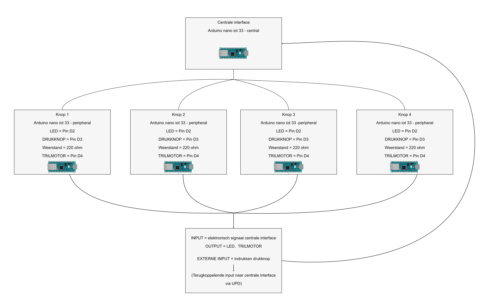

# Selico - Emerging Tech
------
## Opstelling, connecties en feedback.  

  

## Bedradingsschema. 

  

Dit schema wordt viermaal herhaald, één keer voor elke pod. Elke pod bestaat uit een trilmotor, een LED, een drukknop en een Arduino Nano 33 IoT. Deze pods fungeren als "peripherals" en communiceren via het UDP-protocol met een centrale interface, aangeduid als de "central". De centrale is eveneens opgebouwd aan de hand van een Arduino Nano 33 IoT en functioneert volledig autonoom.

Voor het simuleren van het spel met toevoeging van auditieve feedback werd een alternatieve opstelling gebruikt, gebaseerd op een standaard Arduino Nano. Deze keuze werd gemaakt vanwege compatibiliteitsproblemen tussen de Arduino Nano 33 IoT en de DFPlayer Mini module.

  

Tijdens de simulatie werden twee audiobestanden (genummerd 003 en 004) op een microSD-kaart geplaatst. Bestand 003 bevat een geluidseffect dat een correcte actie signaleert, terwijl bestand 004 een foutieve actie aangeeft.

De stapsgewijze opbouw van de code is terug te vinden in de map [Graduele opbouw DFPlayer simulatie](https://github.com/reijnlapere/PGG-Ageing-Young/tree/main/emerging_tech/code/hoofdcode's/Graduele%20opbouw%20simulatie%20DFPlayer%20met%20arduino%20Nano).
Alle hoofdcodes zijn terug te vinden in de map [hoofdcode](https://github.com/reijnlapere/PGG-Ageing-Young/tree/main/emerging_tech/code/hoofdcode's).
Alle basiscodes, ontwikkeld om snel de schakelingen te testen, zijn beschikbaar in de map [basiscodes](https://github.com/reijnlapere/PGG-Ageing-Young/tree/main/emerging_tech/code/basisprogramma's).

